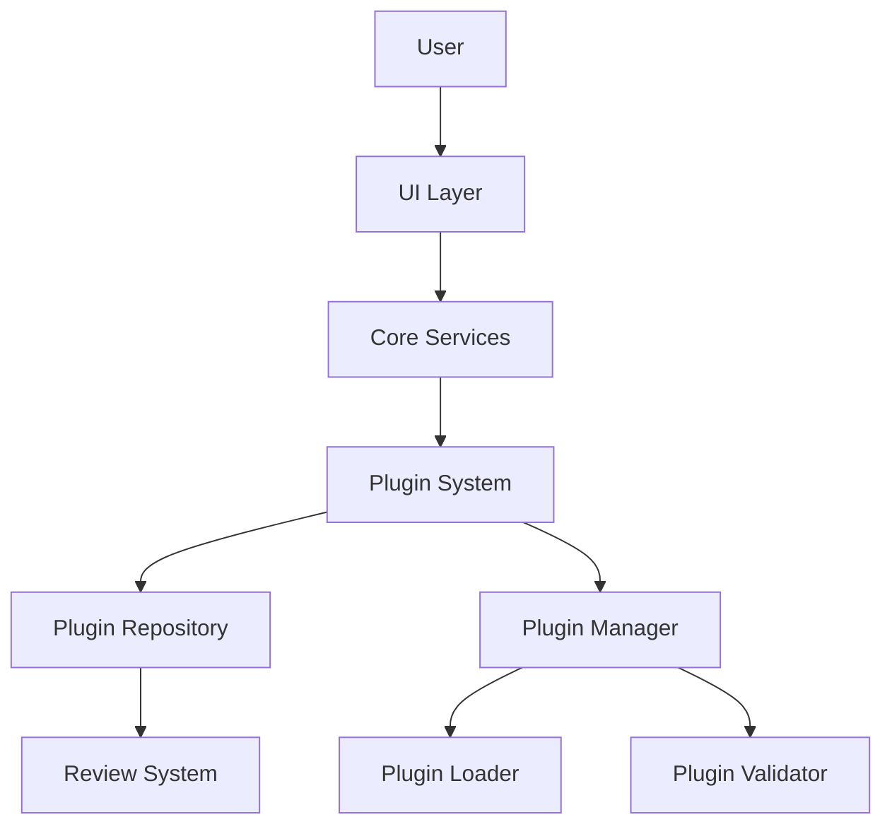
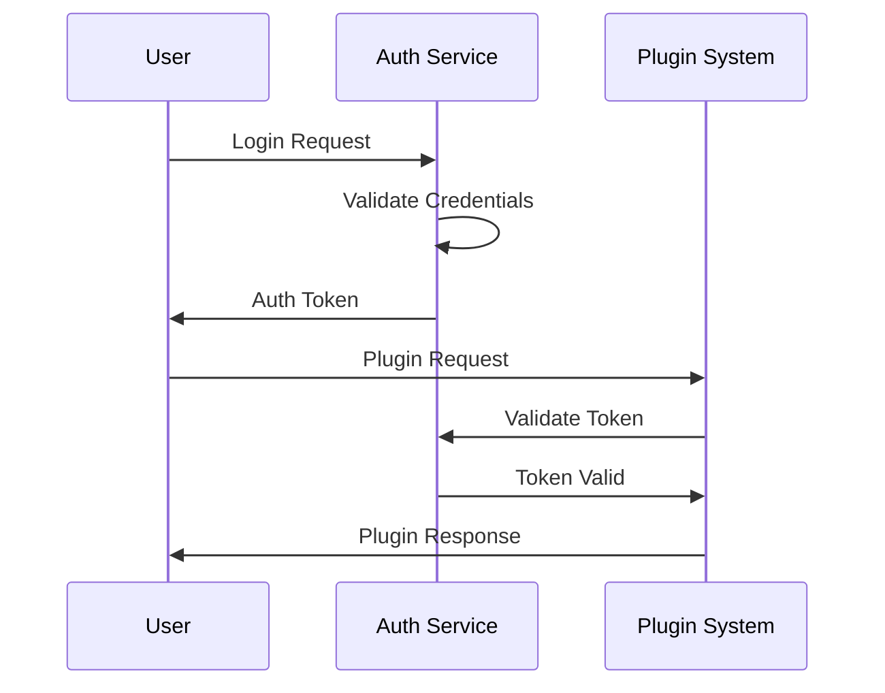
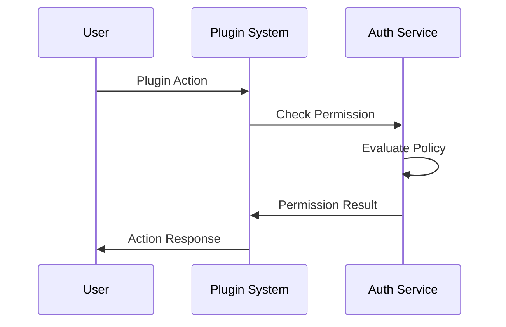

# LUVY Platform Architecture Overview

## System Architecture

### Core Components

1. **Plugin System**
   - Plugin Manager
   - Plugin Loader
   - Plugin Validator
   - Plugin Repository
   - Review System

2. **Core Services**
   - Authentication
   - Authorization
   - Configuration
   - Logging
   - Metrics

3. **UI Components**
   - Flutter UI
   - Plugin Management UI
   - Developer Tools
   - Analytics Dashboard

### Data Flow



## Plugin System

### Components

1. **Plugin Manager**
   - Manages plugin lifecycle
   - Handles plugin activation/deactivation
   - Manages plugin dependencies
   - Provides plugin context

2. **Plugin Loader**
   - Loads plugin binaries
   - Validates plugin structure
   - Initializes plugin instances
   - Manages plugin resources

3. **Plugin Validator**
   - Validates plugin metadata
   - Checks plugin dependencies
   - Verifies plugin signatures
   - Ensures compatibility

4. **Plugin Repository**
   - Manages plugin storage
   - Handles plugin distribution
   - Manages plugin versions
   - Provides plugin search

5. **Review System**
   - Manages user reviews
   - Handles ratings
   - Provides moderation
   - Tracks statistics

### Data Structures

1. **Plugin Metadata**
```rust
pub struct PluginMetadata {
    pub id: Uuid,
    pub name: String,
    pub version: String,
    pub description: String,
    pub author: String,
    pub dependencies: Vec<PluginDependency>,
    pub config_schema: Option<serde_json::Value>,
    pub created_at: DateTime<Utc>,
    pub updated_at: DateTime<Utc>,
}
```

2. **Plugin Context**
```rust
pub struct PluginContext {
    pub info: PluginInfo,
    pub config: Arc<serde_json::Value>,
    pub logger: Arc<Logger>,
    pub metrics: Arc<Metrics>,
}
```

3. **Review Data**
```rust
pub struct Review {
    pub id: Uuid,
    pub plugin_id: Uuid,
    pub user_id: Uuid,
    pub rating: u8,
    pub content: String,
    pub created_at: DateTime<Utc>,
    pub updated_at: DateTime<Utc>,
    pub is_verified_user: bool,
    pub helpful_votes: u32,
    pub status: ReviewStatus,
}
```

## Core Services

### Authentication

1. **Components**
   - User Management
   - Session Management
   - Token Management
   - OAuth Integration

2. **Features**
   - Multi-factor authentication
   - Role-based access control
   - Session persistence
   - Token refresh

### Authorization

1. **Components**
   - Permission Manager
   - Role Manager
   - Policy Engine
   - Access Control

2. **Features**
   - Fine-grained permissions
   - Role inheritance
   - Policy evaluation
   - Access auditing

### Configuration

1. **Components**
   - Config Manager
   - Environment Manager
   - Secret Manager
   - Feature Flags

2. **Features**
   - Hierarchical configuration
   - Environment-specific configs
   - Secure secret storage
   - Dynamic updates

### Logging

1. **Components**
   - Log Manager
   - Log Aggregator
   - Log Analyzer
   - Log Storage

2. **Features**
   - Structured logging
   - Log levels
   - Log rotation
   - Log search

### Metrics

1. **Components**
   - Metrics Collector
   - Metrics Aggregator
   - Metrics Storage
   - Metrics Visualization

2. **Features**
   - Performance metrics
   - Resource usage
   - Error rates
   - Custom metrics

## UI Components

### Flutter UI

1. **Components**
   - Material Design
   - Custom Widgets
   - State Management
   - Navigation

2. **Features**
   - Responsive design
   - Theme support
   - Accessibility
   - Internationalization

### Plugin Management UI

1. **Components**
   - Plugin List
   - Plugin Details
   - Plugin Configuration
   - Plugin Reviews

2. **Features**
   - Search and filter
   - Sort and group
   - Bulk actions
   - Real-time updates

### Developer Tools

1. **Components**
   - Plugin Editor
   - Template Generator
   - Debug Tools
   - Performance Profiler

2. **Features**
   - Code completion
   - Syntax highlighting
   - Debugging
   - Profiling

### Analytics Dashboard

1. **Components**
   - Usage Statistics
   - Performance Metrics
   - Error Reports
   - User Analytics

2. **Features**
   - Real-time updates
   - Custom reports
   - Export data
   - Alerts

## Security Architecture

### Authentication Flow



### Authorization Flow



## Performance Architecture

### Caching Strategy

1. **Cache Levels**
   - Memory Cache
   - Disk Cache
   - Distributed Cache

2. **Cache Policies**
   - LRU Eviction
   - TTL Expiration
   - Write-through
   - Write-back

### Load Balancing

1. **Strategies**
   - Round Robin
   - Least Connections
   - Weighted Distribution
   - Geographic

2. **Health Checks**
   - Active Monitoring
   - Passive Monitoring
   - Custom Checks
   - Auto Recovery

### Scaling

1. **Horizontal Scaling**
   - Stateless Services
   - Load Distribution
   - Service Discovery
   - Auto Scaling

2. **Vertical Scaling**
   - Resource Allocation
   - Performance Tuning
   - Capacity Planning
   - Monitoring

## Deployment Architecture

### Infrastructure

1. **Components**
   - Compute Resources
   - Storage Systems
   - Network Infrastructure
   - Security Services

2. **Features**
   - High Availability
   - Fault Tolerance
   - Disaster Recovery
   - Backup Systems

### Deployment Process

1. **Stages**
   - Development
   - Testing
   - Staging
   - Production

2. **Automation**
   - CI/CD Pipeline
   - Infrastructure as Code
   - Automated Testing
   - Deployment Scripts

### Monitoring

1. **Components**
   - System Monitoring
   - Application Monitoring
   - User Monitoring
   - Security Monitoring

2. **Features**
   - Real-time Alerts
   - Performance Metrics
   - Error Tracking
   - Usage Analytics

## Development Workflow

### Code Organization

1. **Structure**
   - Core Library
   - Plugin System
   - UI Components
   - Tests

2. **Conventions**
   - Code Style
   - Documentation
   - Testing
   - Review Process

### Build Process

1. **Steps**
   - Compilation
   - Testing
   - Packaging
   - Deployment

2. **Tools**
   - Cargo
   - Flutter
   - Docker
   - CI/CD

### Testing Strategy

1. **Levels**
   - Unit Tests
   - Integration Tests
   - System Tests
   - Performance Tests

2. **Automation**
   - Test Runner
   - Coverage Analysis
   - Performance Benchmarks
   - Security Scans

## Future Architecture

### Planned Features

1. **Plugin System**
   - Plugin Marketplace
   - Plugin Analytics
   - Plugin Monetization
   - Plugin Collaboration

2. **Core Services**
   - Advanced Analytics
   - Machine Learning
   - Blockchain Integration
   - IoT Support

3. **UI Components**
   - AR/VR Support
   - Voice Interface
   - Gesture Control
   - AI Assistant

### Scalability Plans

1. **Infrastructure**
   - Cloud Native
   - Edge Computing
   - Serverless
   - Microservices

2. **Performance**
   - Real-time Processing
   - Stream Processing
   - Batch Processing
   - Caching

### Integration Plans

1. **External Services**
   - Cloud Providers
   - Analytics Services
   - Security Services
   - Payment Systems

2. **Standards**
   - Open Standards
   - Industry Protocols
   - Security Standards
   - Compliance 