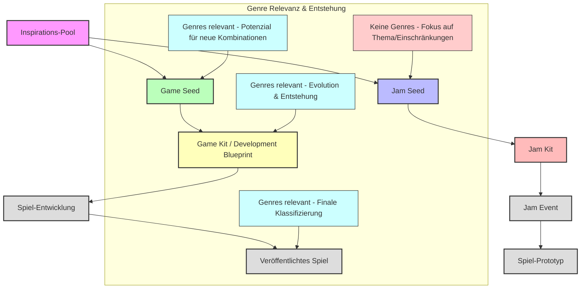

# Konzeptioneller Rahmen für die Spielentwicklung im Ökosystem

Dieses Dokument beschreibt die Kernbegriffe und Phasen im Lebenszyklus einer Spielidee innerhalb unserer Plattform, von der initialen Inspiration bis zum veröffentlichten Spiel. Es beleuchtet auch, wie Game Genres in diesen Prozess integriert werden und wie das Ökosystem die Entstehung neuer Genres fördert.

**Hinweis:** Für detaillierte Definitionen der Kernbegriffe siehe [Terminologie und Konzepte](./terminology_and_concepts.md).

---

## Kernbegriffe und Phasen:

### 1. Inspirations-Pool (Inspiration Pool)
*   **Definition:** Eine dynamische Sammlung aller rohen Ideen, Themen, Keywords, Mechaniken, Stimmungen, Kunststile und anderer kreativer Elemente, die von der Community und der KI beigesteuert werden. Dies ist ein kontinuierlich wachsendes Repository.
*   **Rolle:** Dient als kreative Quelle für alle weiteren Prozesse. Die KI kann hier Muster erkennen und neue Kombinationen vorschlagen.
*   **Genres:** Hier sind Genres noch nicht explizit zugewiesen, aber die Elemente können implizit auf bestimmte Genres hindeuten. Das Ökosystem fördert hier die freie Assoziation, die zu neuartigen Genre-Kombinationen führen kann.

### 2. Jam Seed 🌱
*   **Definition:** Ein flexibler, inspirierender Ausgangspunkt für Game Jam Events. Entwickelt sich durch Community-Feedback und ist genre-agnostisch.
*   **Rolle:** Ermöglicht Community-Brainstorming und kreative Diskussionen. Dient als Basis für die Evolution zu konkreten Jam Kits.
*   **Genres:** **Enthält keine expliziten Genre-Felder**, da der Fokus auf Flexibilität und Community-Kreativität liegt, nicht auf Genre-Klassifizierung.

### 3. Game Seed 🎮
*   **Definition:** Eine konkrete, aber flexible Spielidee für langfristige Projekte. Enthält explizite Genre-Zuweisungen und wird oft durch das KI-Multi-Agenten-System generiert.
*   **Rolle:** Dient als inspirierender Startpunkt für professionelle Spielentwicklung. Diese Seeds können von der Community weiter verfeinert und gewählt werden.
*   **Genres:** **Enthält ein `genres`-Feld** (`List<String> genres`), das die beabsichtigte Genre-Richtung des Spiels festlegt. Dies ist der Punkt, an dem Genres explizit mit der Spielidee verknüpft werden.

### 4. Jam Kit 🛠️
*   **Definition:** Ein konkreter, umsetzbarer Leitfaden für Game Jam Events. Entwickelt sich aus Jam Seeds und ist für den Jam-Zeitrahmen optimiert.
*   **Rolle:** Bietet spezifische Anweisungen, Asset-Vorschläge und Bauanleitungen für die schnelle Umsetzung im Game Jam Kontext.
*   **Genres:** **Enthält keine expliziten Genre-Felder**, da der Fokus auf dem Jam-Thema und den Einschränkungen liegt, nicht auf Genre-Klassifizierung.

### 5. Game Kit (Development Blueprint) 📋
*   **Definition:** Eine umfassende, detaillierte Blaupause für langfristige Spielentwicklung. Entwickelt sich aus Game Seeds und enthält vollständige Entwicklungsanleitungen.
*   **Rolle:** Bietet umfassende Spezifikationen, technische Details und Ressourcen für professionelle, kommerzielle Spielentwicklung.
*   **Genres:** **Enthält explizite Genre-Definitionen** und detaillierte Genre-spezifische Anforderungen.

### 6. Jam Event
*   **Definition:** Die aktive Phase eines Game Jams, in der Entwickler und Hobbyisten auf Basis eines Jam Kits Spiele entwickeln.
*   **Rolle:** Die Plattform für kollaborative, zeitlich begrenzte Spielentwicklung.
*   **Genres:** Die Genres der hier entstehenden Spiele ergeben sich aus der kreativen Umsetzung durch die Teams, basierend auf dem Jam Kit.

### 7. Spiel-Entwicklung
*   **Definition:** Der professionelle Entwicklungsprozess, der auf Basis einer Game Kit (Development Blueprint) durchgeführt wird.
*   **Rolle:** Langfristige, strukturierte Spielentwicklung mit klaren Zielen und Ressourcen.
*   **Genres:** Die Genres sind durch die Game Kit definiert und werden während der Entwicklung weiter verfeinert.

### 8. Spiel-Prototyp
*   **Definition:** Eine erste spielbare Version eines Spiels, die aus einem Jam Event oder einer Spiel-Entwicklung entstanden ist.
*   **Rolle:** Dient zur Validierung der Idee, zum Sammeln von Feedback und zur weiteren Iteration.
*   **Genres:** Die Genres des Prototyps sind nun klarer definiert und können sich durch die praktische Umsetzung weiterentwickeln oder neue hybride Formen annehmen.

### 9. Veröffentlichtes Spiel
*   **Definition:** Das fertige, polierte Spiel, das für die Öffentlichkeit zugänglich gemacht wurde.
*   **Rolle:** Das Endprodukt des gesamten Entwicklungsprozesses.
*   **Genres:** Die finalen Genres, unter denen das Spiel vermarktet und kategorisiert wird. Hier können auch *neue, vom Ökosystem hervorgebrachte Genres* offiziell benannt und etabliert werden.

---

## Entwicklungswege

### Weg 1: Game Jam Route (Community-getrieben)
1. **Inspirations-Pool** → **Jam Seed** (Community-Brainstorming)
2. **Jam Seed** → **Jam Kit** (Konkretisierung für Jam)
3. **Jam Kit** → **Jam Event** (Umsetzung im Game Jam)
4. **Jam Event** → **Spiel-Prototyp** (Ergebnis des Jams)

### Weg 2: Langfristige Entwicklung (KI-getrieben)
1. **Inspirations-Pool** → **Game Seed** (KI-generiert mit Genre-Fokus)
2. **Game Seed** → **Game Kit** (Entwicklung zu umfassender Blaupause)
3. **Game Kit** → **Spiel-Entwicklung** (Professionelle Umsetzung)
4. **Spiel-Entwicklung** → **Veröffentlichtes Spiel** (Endprodukt)

---

## KI-Integration und Genre-Evolution

### Ideen-Generator (Idea Generator)
*   **Definition:** Der Prozess (gesteuert durch das KI-Multi-Agenten-System und die Community), der aus dem `Inspirations-Pool` eine Vielzahl von konkreten Spielideen generiert.
*   **Rolle:** Die zentrale Engine für die Kreativität im Ökosystem. Sie kann auf Basis eines gegebenen Informationssets (z.B. Keywords, Genres) unzählige `Game Seeds` erzeugen.
*   **Genres:** In diesem Schritt werden die Genres für die generierten `Game Seeds` festgelegt. Die KI kann hier innovative Genre-Kombinationen vorschlagen, die über traditionelle Kategorien hinausgehen und zur Entstehung neuer Genres beitragen.

### Genre-Evolution
Das Ökosystem fördert die Entstehung neuer Genres durch:
- **Flexible Jam Seeds:** Ermöglichen kreative Interpretationen ohne Genre-Beschränkungen
- **KI-generierte Game Seeds:** Kombinieren traditionelle Genres in innovativen Weisen
- **Community-Feedback:** Entwickelt und verfeinert Genre-Kombinationen
- **Experimentelle Game Kits:** Testen neue Genre-Hybride in der Praxis

---

## Asset-Listen und Bauanleitungen

In diesem neuen Rahmen sind die KI-generierten Asset-Listen, Bauanleitungen und ähnliche detaillierte Ressourcen in den folgenden Konzepten angesiedelt:

### Jam Kit
Enthält **vereinfachte und auf den Jam-Zeitrahmen zugeschnittene** Asset-Vorschläge und Bauanleitungen. Da der Fokus auf Schnelligkeit liegt, sind diese Ressourcen prägnant und direkt umsetzbar.

### Game Kit (Development Blueprint)
Enthält **umfassende, detaillierte und skalierbare** Asset-Spezifikationen, ausführliche Bauanleitungen, technische Spezifikationen und weitere Ressourcen, die für eine langfristige, professionelle Spielentwicklung benötigt werden.

### Game Seeds
Enthalten keine detaillierten Asset-Listen, sondern eher *Vorschläge für Kunststile* oder *generelle Asset-Typen*, die zur Idee passen. Die konkreten Listen und Anleitungen entstehen erst in den detaillierteren "Kits" oder "Blueprints".

---

## Implementierung

Die Implementierung dieser Konzepte erfolgt über:

- **Datenmodelle:** `JamSeed`, `JamKit`, `GameSeed`, `DevelopmentBlueprint`
- **Services:** `JamSeedGenerationService`, `JamSeedEvolutionService`, `ConceptGenerationService`
- **UI-Komponenten:** Community Hub, Jam Kit Viewer, Game Seed Browser, Development Blueprint Editor

Für detaillierte Implementierungsinformationen siehe [Terminologie und Konzepte](./terminology_and_concepts.md).
