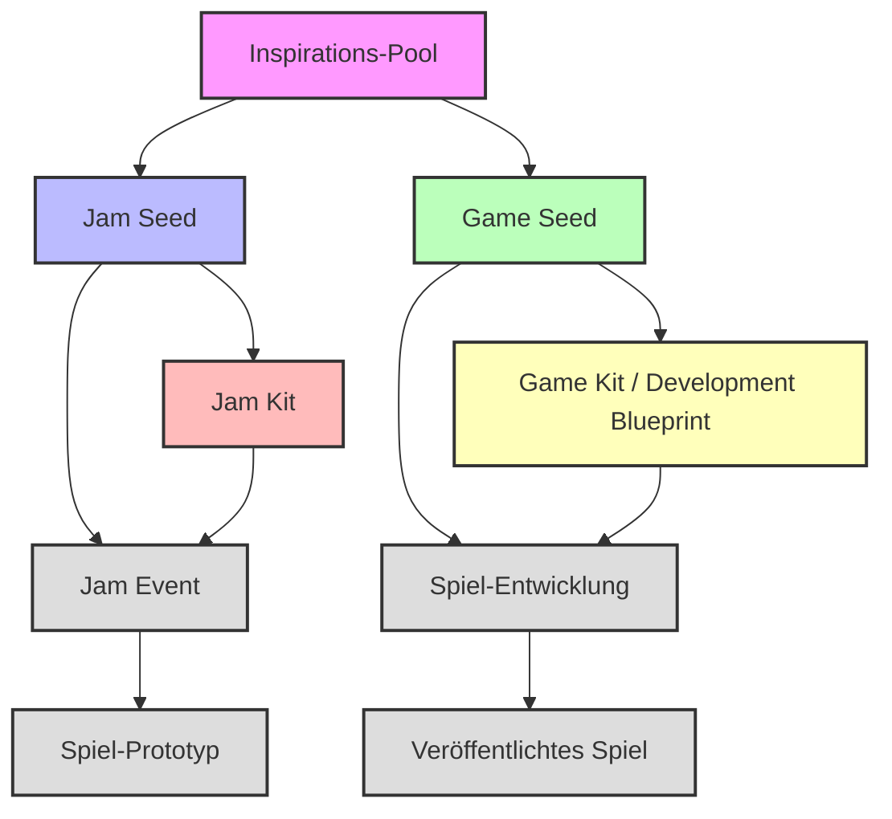

# Terminologie und Konzepte - Klare Definitionen

Dieses Dokument definiert die vier Kernbegriffe der Plattform und ihre Beziehungen zueinander. Diese Begriffe sind fundamental für das Verständnis der Plattform-Architektur und der Entwicklungsprozesse.

## Kernbegriffe

### 1. Jam Seed 🌱
**Definition:** Ein flexibler, inspirierender Ausgangspunkt für Game Jam Events.

**Eigenschaften:**
- **Flexibel:** Offen für verschiedene Interpretationen und Community-Beiträge
- **Inspirierend:** Soll Kreativität anregen, nicht einschränken
- **Community-getrieben:** Entwickelt sich durch Community-Feedback weiter
- **Genre-agnostisch:** Enthält keine expliziten Genre-Zuweisungen

**Inhalt:**
- Kernkonzept (flexibel, nicht spezifisch)
- Inspirations-Elemente (Keywords, Ideen, Referenzen)
- Kreative Einschränkungen (Richtlinien, nicht Regeln)
- Community-Beiträge und Voting-System
- Status-Tracking (Brainstorming → Verfeinerung → Evolution)

**Verwendung:** Wird in der Community diskutiert, verfeinert und kann sich zu einem Jam Kit entwickeln.

---

### 2. Jam Kit 🛠️
**Definition:** Ein konkreter, umsetzbarer Leitfaden für Game Jam Events.

**Eigenschaften:**
- **Konkret:** Spezifische Anweisungen und Ressourcen
- **Umsetzbar:** Direkt für Game Jam Entwicklung verwendbar
- **Zeitlich begrenzt:** Optimiert für Jam-Zeitrahmen
- **Vereinfacht:** Fokus auf Schnelligkeit und Umsetzbarkeit

**Inhalt:**
- Spezifisches Thema und Setting
- Klare Quests/Objekte
- Asset-Vorschläge mit Style-Prompts
- Bauanleitungen (vereinfacht für Jam-Zeitrahmen)
- Geschätzte Entwicklungszeit
- Komplexitäts-Level

**Verwendung:** Wird direkt in Game Jam Events verwendet, um Spiele zu entwickeln.

---

### 3. Game Seed 🎮
**Definition:** Eine konkrete, aber flexible Spielidee für langfristige Projekte.

**Eigenschaften:**
- **Genre-spezifisch:** Enthält explizite Genre-Zuweisungen
- **Flexibel:** Ermöglicht verschiedene Umsetzungsansätze
- **Langfristig:** Für professionelle Spielentwicklung gedacht
- **KI-generiert:** Oft durch KI-Multi-Agenten-System erstellt

**Inhalt:**
- Kernkonzept mit Genre-Fokus
- Vorgeschlagene Mechaniken
- Grobe Story-Idee
- Genre-Liste (explizit)
- Vorgeschlagener Kunststil
- Zielgruppe
- Monetarisierungs-Strategie

**Verwendung:** Dient als Startpunkt für professionelle Spielentwicklung, kann sich zu einer Development Blueprint entwickeln.

---

### 4. Game Kit (Development Blueprint) 📋
**Definition:** Eine umfassende, detaillierte Blaupause für langfristige Spielentwicklung.

**Eigenschaften:**
- **Umfassend:** Vollständige Entwicklungsanleitung
- **Detailliert:** Ausführliche Spezifikationen und Ressourcen
- **Skalierbar:** Für professionelle, kommerzielle Entwicklung
- **Genre-definiert:** Klare Genre-Klassifizierung

**Inhalt:**
- Detailliertes Kernkonzept
- Spezifische Genre-Definition
- Umfassende Quest-Struktur
- Detaillierte Asset-Spezifikationen
- Ausführliche Bauanleitungen
- Technische Spezifikationen
- Monetarisierungs-Strategie
- Ziel-Plattformen
- Geschätzte Entwicklungszeit

**Verwendung:** Wird für professionelle, langfristige Spielentwicklung verwendet.

---

## Beziehungen und Entwicklungsprozesse

### Entwicklungswege

#### Weg 1: Game Jam Route
1. **Inspirations-Pool** → **Jam Seed** (Community-Brainstorming)
2. **Jam Seed** → **Jam Kit** (Konkretisierung für Jam)
3. **Jam Kit** → **Jam Event** (Umsetzung im Game Jam)
4. **Jam Event** → **Spiel-Prototyp** (Ergebnis des Jams)

#### Weg 2: Langfristige Entwicklung
1. **Inspirations-Pool** → **Game Seed** (KI-generiert mit Genre-Fokus)
2. **Game Seed** → **Game Kit** (Entwicklung zu umfassender Blaupause)
3. **Game Kit** → **Spiel-Entwicklung** (Professionelle Umsetzung)
4. **Spiel-Entwicklung** → **Veröffentlichtes Spiel** (Endprodukt)

---

## Unterschiede in der Praxis

| Aspekt | Jam Seed | Jam Kit | Game Seed | Game Kit |
|--------|----------|---------|-----------|----------|
| **Zweck** | Community-Inspiration | Jam-Umsetzung | Spielidee | Entwicklungsplan |
| **Zeitrahmen** | Flexibel | Jam-Zeitrahmen | Langfristig | Langfristig |
| **Genre** | Keine | Keine | Explizit | Explizit |
| **Detaillierungsgrad** | Minimal | Vereinfacht | Mittel | Umfassend |
| **Community-Rolle** | Hoch | Mittel | Niedrig | Niedrig |
| **KI-Rolle** | Unterstützend | Unterstützend | Hauptsächlich | Hauptsächlich |

---

## Implementierung in der Plattform

### Datenmodelle
- **JamSeed:** `lib/src/features/a_ideation/domain/jam_seed.dart`
- **JamKit:** `lib/src/features/a_ideation/domain/jam_kit.dart`
- **GameSeed:** `lib/src/features/a_ideation/domain/game_seed.dart`
- **DevelopmentBlueprint:** `lib/src/features/a_ideation/domain/development_blueprint.dart`

### Services
- **JamSeedGenerationService:** Generiert flexible Jam Seeds
- **JamSeedEvolutionService:** Entwickelt Jam Seeds zu Jam Kits
- **ConceptGenerationService:** Generiert Game Seeds und Development Blueprints
- **AgenticConceptGenerationService:** Multi-Agenten-System für Game Seeds

### UI-Komponenten
- **Community Hub:** Für Jam Seed Diskussion und Voting
- **Jam Kit Viewer:** Für Jam Kit Anzeige und Verwendung
- **Game Seed Browser:** Für Game Seed Durchsuchung
- **Development Blueprint Editor:** Für Game Kit Erstellung und Bearbeitung

**Project Lifecycle Management:**
The [ProjectMasterAgent](../../features/general/project_master_agent.md) is the central component responsible for managing the instances and lifecycle of these JamSeeds, JamKits, GameSeeds, and GameKits within a specific project or game jam. It would utilize the services mentioned above (e.g., `JamSeedGenerationService`, `ConceptGenerationService`) to create and evolve these entities.

---

## Best Practices

### Für Jam Seeds
- Halte sie flexibel und inspirierend
- Fördere Community-Beiträge
- Vermeide zu spezifische Vorgaben
- Nutze Voting-System für Evolution

### Für Jam Kits
- Mache sie konkret und umsetzbar
- Optimiere für Jam-Zeitrahmen
- Biete klare Anweisungen
- Inkludiere Asset-Vorschläge

### Für Game Seeds
- Definiere klare Genres
- Biete flexible Umsetzungsmöglichkeiten
- Nutze KI für innovative Kombinationen
- Fokussiere auf langfristige Entwicklung

### Für Game Kits
- Erstelle umfassende Spezifikationen
- Biete detaillierte Ressourcen
- Plane für professionelle Entwicklung
- Inkludiere technische Details

---

Diese klare Terminologie bildet die Grundlage für alle weiteren Dokumentationen und Implementierungen in der Plattform. 