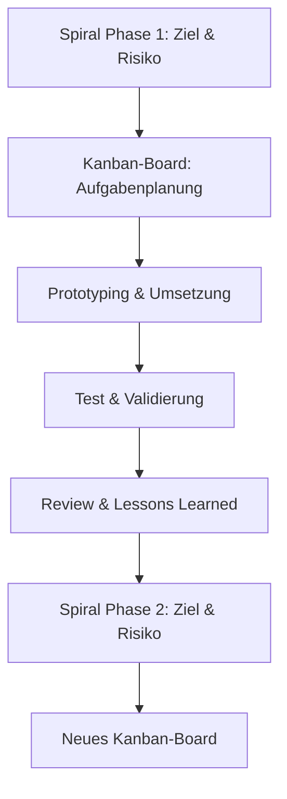

# JamBam Master-Roadmap (2024–2026) – Solo Edition

## Strategischer Rahmen: Spiralmodell & Kanban

Diese Roadmap kombiniert das Spiralmodell (für Phasen, Risiko, Innovation, Forschung) mit Kanban (für operative Umsetzung, Transparenz und kontinuierlichen Fortschritt). Jede Phase entspricht einem Spiralzyklus und wird operativ über ein Kanban-Board gesteuert.

---

## Zeitliche Struktur & Phasen

### Pre-Phase: Foundations & Setup  
**Zeitraum:** bis Anfang August 2025  
**Ziele:**
- Technische Infrastruktur, CI/CD, Security-Standards
- Markt- und Nutzerforschung, Personas, Use Cases
- Fördermittel, Seed-Finanzierung
- Initiale Community- und Marketing-Aktivitäten (minimal)
- Detaillierte Roadmap und Governance finalisieren
- Automatisierung von Build, Test und Deployment

---

### Phase 1: MVP & Core Platform  
**Zeitraum:** bis 10. September 2025  
**Ziele:**
- MVP-Entwicklung (Backend, Flutter-Frontend, erste KI-Services)
- User-Auth, Asset-Upload, Basis-Community-Features
- Erste Game Jam-Integration, Asset-Generator (BrickGPT, DreamFusion)
- Masterthesis: Grundlegende Architektur, erste Forschungsergebnisse
- Interne Alpha-Tests, Feedbackschleifen (ggf. mit externem Feedback)
- Fokus auf Automatisierung und Selbstmanagement

---

### Phase 2: Community & Marketplace  
**Zeitraum:** bis 10. November 2025  
**Ziele:**
- Community-Hub, Asset-Bewertung, Remixing, Social Features (minimal)
- Marketplace (Freemium, Lizenzsystem, Monetarisierung)
- Erweiterte KI-Generierung, Postprocessing, Animation
- Masterthesis: Abschluss der zentralen Forschungsarbeit
- Beta-Tests mit ausgewählten Usern (ggf. externes Feedback einholen)

---

### Phase 3: Launch & Academic Milestone  
**Zeitraum:** bis 10. Januar 2026  
**Ziele:**
- Offizieller Launch (Öffentliche Beta, Soft Launch)
- Masterthesis: Abgabe und Verteidigung
- Öffentlichkeitsarbeit, Marketing-Offensive (Solo-geeignet)
- Onboarding von ersten Partnern/API-Integrationen (optional, nach Kapazität)
- Community-Wachstum, Feedback-Integration (fokussiert)

---

### Phase 4: Expansion & Advanced Features  
**Zeitraum:** bis 10. April 2026  
**Ziele:**
- Unity/Godot/Unreal-Integration, Engine-Adapter (nur, wenn Kapazität)
- Erweiterte 3D- und KI-Features (z.B. Gaussian Splatting, Auto-Rigging)
- Wettbewerbsfunktionen, Gamification (minimal, MVP)
- Skalierung der Plattform (Performance, Security, DevOps)
- Internationale Expansion vorbereiten (nur vorbereiten, nicht umsetzen)

---

### Phase 5: Growth & Scaling  
**Zeitraum:** bis 10. Juni 2026  
**Ziele:**
- Monitoring, Analytics, kontinuierliche Optimierung
- Erweiterung des Marktplatzes, neue Monetarisierungsmodelle (nach Kapazität)
- Community-Events, Wettbewerbe, Creator-Programme (optional, minimal)
- Fokus auf nachhaltige Solo-Entwicklung und Automatisierung
- **Aktive Partnerschaftssuche und Netzwerkaufbau (ab Ende 2025):** Gezielte Suche nach Kooperationspartnern, potenziellen Teammitgliedern oder strategischen Allianzen zur Skalierung und Weiterentwicklung.

---

### Phase 6: Ecosystem & Open Innovation  
**Zeitraum:** bis 10. August 2026  
**Ziele:**
- Öffnung der Plattform für externe Entwickler (Open API, SDKs, Plugins) – nur vorbereiten
- Förderung von Community-Plugins und KI-Agenten (optional, nach Kapazität)
- Open-Source-Initiativen, Developer-Portal (nur vorbereiten)
- Innovationsförderung (z.B. Hackathons, Forschungsprojekte, falls möglich)
- Nachhaltigkeit, Diversity, Inklusion (Solo-geeignete Maßnahmen)
- **Partnerschaften und Kooperationen ausbauen:** Aufbau und Pflege von Partnerschaften, um das Ökosystem zu stärken und neue Innovationspotenziale zu erschließen.

---

### Phase 7: Future Vision & Continuous Improvement  
**Zeitraum:** ab August 2026 (laufend)  
**Ziele:**
- Kontinuierliche Weiterentwicklung (AI, XR, neue Engines, neue Märkte)
- Forschungspartnerschaften, EU-Projekte (nur bei Kapazität)
- Visionäre Features (z.B. Quantum-Ready, Metaverse-Integration, nach Kapazität)
- Starke Community, Thought Leadership, europäische Marktführerschaft (langfristig, nach Team-Erweiterung)

---

## Operative Umsetzung: Kanban-Boards pro Phase (Solo)

- Einfache Kanban-Boards pro Phase (z.B. GitHub Projects, Trello)
- Spalten: Backlog, In Arbeit, Review/Test, Done
- WIP-Limit = 1 (immer nur eine Aufgabe gleichzeitig)
- Karten: User Stories, Tasks, Bugs, Research, Prototypen, Dokumentation
- Wöchentliche Mini-Ziele (Sprint light)
- Am Ende jeder Phase: Review, Lessons Learned, Übergabe an nächste Phase

---

## Visualisierung: Spiralmodell & Kanban

---

## Hinweise zur Anwendung (Solo)

- Die Roadmap ist flexibel und wird regelmäßig an neue Erkenntnisse und Marktanforderungen angepasst.
- Jede Phase endet mit einem Review, Lessons Learned und klaren Übergabekriterien zur nächsten Phase.
- Kanban-Boards werden kontinuierlich gepflegt und dienen als zentrales Tool für Transparenz und Selbstmanagement.
- Automatisierung (z.B. GitHub Actions) kann Status, Tests und Deployments mit dem Board verknüpfen.
- Fokus auf Priorisierung, Automatisierung und nachhaltige Solo-Entwicklung.

---

**Mit dieser Solo-Kombination erreichst du maximale Effizienz, Risikokontrolle und nachhaltigen Fortschritt – ideal für ambitionierte Einzelentwickler!** 