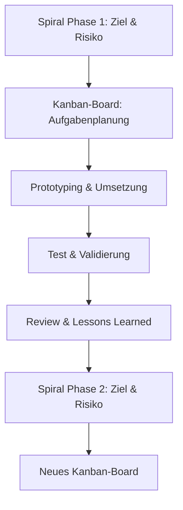

# JamBam Master-Roadmap (2024–2026) – Solo Edition
-----------
## Strategischer Rahmen: Spiralmodell & Kanban

Diese Roadmap kombiniert das Spiralmodell (für Phasen, Risiko, Innovation, Forschung) mit Kanban (für operative Umsetzung, Transparenz und kontinuierlichen Fortschritt). Jede Phase entspricht einem Spiralzyklus und wird operativ über ein Kanban-Board gesteuert.

---

## Zeitliche Struktur & Phasen

### Pre-Phase: Foundations & Setup  
**Zeitraum:** bis Anfang August 2025  
**Ziele:**
- Technische Infrastruktur, CI/CD, Security-Standards
- Markt- und Nutzerforschung, Personas, Use Cases
- Fördermittel, Seed-Finanzierung
- Initiale Community- und Marketing-Aktivitäten (minimal)
- Detaillierte Roadmap und Governance finalisieren
- Automatisierung von Build, Test und Deployment

---

### Phase 1: MindFlow Engine – MVP & Core Platform  
**Zeitraum:** bis 10. September 2025  
**Ziele:**
- MVP-Entwicklung der MindFlow Engine (AuraVention)
- KI-gestützte Ideation, Asset-Generierung, Automatisierung
- Erste Game Jam-Integration (Solo/kleine Teams)
- Masterthesis: Grundlegende Architektur, erste Forschungsergebnisse
- Interne Alpha-Tests, Feedbackschleifen (ggf. mit externem Feedback)
- Fokus auf Automatisierung und Selbstmanagement

---

### Phase 2: MindFlow Engine – Advanced Features  
**Zeitraum:** bis 10. November 2025  
**Ziele:**
- Erweiterung der MindFlow Engine (AuraVention) um fortgeschrittene KI- und Automatisierungsfunktionen
- Verbesserte Asset-Generierung, Postprocessing, Animation
- Integration in weitere Workflows (z.B. Game Jam, Prototyping)
- Masterthesis: Abschluss der zentralen Forschungsarbeit
- Beta-Tests mit ausgewählten Usern (ggf. externes Feedback einholen)

---

### Phase 3: MindFlow Engine – Integration & Launch  
**Zeitraum:** bis 10. Januar 2026  
**Ziele:**
- Integration der MindFlow Engine in verschiedene Entwicklungsumgebungen
- Offizieller Launch (Öffentliche Beta, Soft Launch) der MindFlow Engine (AuraVention)
- Masterthesis: Abgabe und Verteidigung
- Öffentlichkeitsarbeit, Marketing-Offensive (Solo-geeignet)
- Onboarding von ersten Partnern/API-Integrationen (optional, nach Kapazität)
- Community-Wachstum, Feedback-Integration (fokussiert)

---

### Phase 4: MindFlow Engine – Continuous Improvement & Ecosystem Preparation  
**Zeitraum:** bis 10. April 2026  
**Ziele:**
- Kontinuierliche Weiterentwicklung der MindFlow Engine (Features, Performance, KI-Modelle)
- Vorbereitung auf Ökosystem-Integration (API, SDK, Plugins)
- Dokumentation, Developer-Experience, Open-Source-Vorbereitung
- Partnerschaftssuche, Netzwerkaufbau

---

### Phase 5: Project Y & Ecosystem – Community & Social Platform  
**Zeitraum:** bis 10. Juni 2026  
**Ziele:**
- Aufbau der Community- und Social-Plattform (Project Y)
- Integration der MindFlow Engine als zentrales KI-Feature
- Teamwork, Gamification, User-Profile, Community-Hub
- Beta-Tests mit Fokus auf Kollaboration und Social Features
- Wettbewerbsfunktionen, Creator-Programme (umfangreich, MVP)
- Engine-Adapter, Unity/Godot/Unreal-Integration (nach Kapazität)
- Erweiterte 3D- und KI-Features (z.B. Gaussian Splatting, Auto-Rigging)
- Skalierung der Plattform (Performance, Security, DevOps)
- Monitoring, Analytics, kontinuierliche Optimierung
- Erweiterung des Marktplatzes, neue Monetarisierungsmodelle

---

### Phase 6: Open Innovation & Global Ecosystem  
**Zeitraum:** bis 10. August 2026  
**Ziele:**
- Öffnung der Plattform für externe Entwickler (Open API, SDKs, Plugins)
- Förderung von Community-Plugins und KI-Agenten
- Open-Source-Initiativen, Developer-Portal
- Innovationsförderung (z.B. Hackathons, Forschungsprojekte)
- Nachhaltigkeit, Diversity, Inklusion
- Partnerschaften und Kooperationen ausbauen
- Internationale Expansion vorbereiten

---

### Phase 7: Future Vision & Continuous Improvement  
**Zeitraum:** ab August 2026 (laufend)  
**Ziele:**
- Kontinuierliche Weiterentwicklung (AI, XR, neue Engines, neue Märkte)
- Forschungspartnerschaften, EU-Projekte
- Visionäre Features (z.B. Quantum-Ready, Metaverse-Integration)
- Starke Community, Thought Leadership, europäische Marktführerschaft

---

## Operative Umsetzung: Kanban-Boards pro Phase (Solo)

- Einfache Kanban-Boards pro Phase (z.B. GitHub Projects, Trello)
- Spalten: Backlog, In Arbeit, Review/Test, Done
- WIP-Limit = 1 (immer nur eine Aufgabe gleichzeitig)
- Karten: User Stories, Tasks, Bugs, Research, Prototypen, Dokumentation
- Wöchentliche Mini-Ziele (Sprint light)
- Am Ende jeder Phase: Review, Lessons Learned, Übergabe an nächste Phase

---

## Visualisierung: Spiralmodell & Kanban

---

## Hinweise zur Anwendung (Solo)

- Die Roadmap ist flexibel und wird regelmäßig an neue Erkenntnisse und Marktanforderungen angepasst.
- Jede Phase endet mit einem Review, Lessons Learned und klaren Übergabekriterien zur nächsten Phase.
- Kanban-Boards werden kontinuierlich gepflegt und dienen als zentrales Tool für Transparenz und Selbstmanagement.
- Automatisierung (z.B. GitHub Actions) kann Status, Tests und Deployments mit dem Board verknüpfen.
- Fokus auf Priorisierung, Automatisierung und nachhaltige Solo-Entwicklung.

---

**Mit dieser Solo-Kombination erreichst du maximale Effizienz, Risikokontrolle und nachhaltigen Fortschritt – ideal für ambitionierte Einzelentwickler!** 