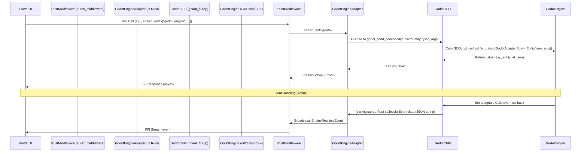

# Godot Engine Integration with Flutter via Rust Middleware

This document outlines the architecture and communication flow for integrating a Godot game engine instance with the Flutter application, facilitated by the Rust-based `aurax_middleware`.

## Overview

The integration allows the Flutter UI to control and interact with a Godot engine instance. This is achieved by Flutter making FFI (Foreign Function Interface) calls to the Rust middleware, which then communicates with the Godot engine via its own C FFI layer.



## Components

1.  **Flutter UI:** The user interface making requests.
2.  **Rust Middleware (`aurax_middleware`):**
    *   Exposes an FFI API to Flutter (see `aurax_middleware/src/ffi_editor_api.rs`) using `flutter_rust_bridge`.
    *   Contains the `EngineManager` for managing different engine adapters.
    *   Includes the `GodotEngineAdapter`.
3.  **`GodotEngineAdapter` (`aurax_middleware/src/godot_adapter.rs`):**
    *   Implements the `EngineAdapter` trait.
    *   Wraps the C FFI calls to the Godot engine.
    *   Manages communication logic, including command execution and event handling.
    *   Uses shared data structures from `aurax_middleware/src/engine_common_models.rs`.
4.  **Godot C FFI Layer (`engines/godot_engine/src/godot_ffi.cpp` and `.h`):**
    *   A C++ GDNative (or GDExtension) library that exposes C functions callable from Rust.
    *   These C functions, in turn, interact with a designated GDScript node (typically `/root/GodotAdapter`) in the running Godot scene tree to execute commands or retrieve information.
    *   It's responsible for converting data between C types/JSON strings and Godot Variants/Objects.
    *   It must also provide a mechanism to free memory allocated for strings returned to Rust.
5.  **Godot Engine Instance:**
    *   Runs the actual game scene and logic.
    *   Requires a specific GDScript node (e.g., `GodotAdapter.gd` attached to `/root/GodotAdapter`) that implements methods corresponding to the commands sent from the middleware (e.g., `SpawnEntity`, `SetEntityProperties`, `GetInfo`).

## Communication Flow

### Command Execution (Flutter to Godot)

1.  The Flutter UI initiates an action (e.g., spawning an entity).
2.  It calls an FFI function in `aurax_middleware/src/ffi_editor_api.rs` (e.g., `create_scene_object`), specifying the `engine_id` for Godot.
3.  The FFI function in Rust uses the `GLOBAL_ENGINE_MANAGER` to retrieve the `GodotEngineAdapter` instance.
4.  The corresponding method on the `GodotEngineAdapter` (e.g., `spawn_entity`) is called.
5.  The adapter constructs a JSON string representing the command and its arguments (often using shared structs from `engine_common_models.rs`).
6.  It calls the relevant C FFI function in its internal `ffi` module (which links to `godot_ffi.cpp`). For many operations, this is `godot_send_command(command_name_json, args_json)`.
7.  The C FFI function in `godot_ffi.cpp` parses the command/args and calls the appropriate method on the `/root/GodotAdapter` GDScript node.
8.  The GDScript method executes the command within the Godot scene.
9.  If the command returns data, the GDScript node returns it to the C FFI function, which converts it to a JSON string (`char*`).
10. The `GodotEngineAdapter` receives this `char*`, converts it to a Rust `String` (and frees the C string using `godot_free_string`), parses it into `serde_json::Value`, and returns it as an `EngineResult`.
11. This result propagates back to the Flutter UI via the FFI callback.

### Event Handling (Godot to Flutter) - Planned

The `GodotEngineAdapter` is designed to broadcast events using `tokio::sync::broadcast::Sender<EngineRealtimeEvent>`. Flutter subscribes to these events via the `connect_to_scene_updates` FFI stream.

The mechanism for Godot to send events to the Rust middleware is planned as follows:

1.  **Callback Registration:**
    *   Rust (`GodotEngineAdapter`) will provide a static C-callable Rust function (e.g., `static_godot_event_callback(event_json_ptr: *const c_char)`).
    *   During initialization, or through a dedicated FFI call, the `GodotEngineAdapter` will register this callback function with the Godot C FFI layer (e.g., `godot_register_event_callback(static_godot_event_callback)`).
2.  **Event Emission in Godot:**
    *   When an event occurs in Godot (e.g., an entity moves, a property changes), the relevant GDScript code (likely in `/root/GodotAdapter` or connected signals) will:
        *   Serialize the event data into a JSON string.
        *   Call a C FFI function (e.g., `emit_event_to_rust(event_json_string)`) provided by `godot_ffi.cpp`.
3.  **Forwarding in C FFI Layer:**
    *   The `emit_event_to_rust` C FFI function will invoke the registered Rust callback (`static_godot_event_callback`) with the event JSON string.
4.  **Processing in Rust Callback:**
    *   The `static_godot_event_callback` in Rust will:
        *   Convert the `*const c_char` to a Rust `String`.
        *   Parse the JSON string into a temporary Godot-specific event struct or `serde_json::Value`.
        *   Map this to one of the standardized `EngineRealtimeEvent` variants (from `engines_api/models.rs`).
        *   Send this `EngineRealtimeEvent` through the `GodotEngineAdapter`'s `event_sender` (the broadcast channel). This requires the static callback to have access to the `event_sender`, possibly by storing `Arc<broadcast::Sender<EngineRealtimeEvent>>` in a `lazy_static` or `OnceCell` accessible by the static callback, or if the FFI allows passing a `user_data` pointer during callback registration.

This ensures that events from Godot are standardized and consumed by Flutter in the same way as events from other engines.

## Setup Requirements

*   The Godot project must include the compiled GDNative/GDExtension library generated from `engines/godot_engine/src/godot_ffi.cpp`.
*   A node named `GodotAdapter` (or as configured) must exist at `/root/GodotAdapter` in the Godot scene tree, with a GDScript attached that implements the necessary methods to handle commands from the middleware.
*   The `aurax_middleware` library must be compiled with the Godot FFI features and correctly linked.

## Data Serialization

Communication between Rust and the Godot C FFI layer primarily uses JSON strings (`char*`) for structured data to simplify FFI calls. The `GodotEngineAdapter` uses `serde_json` for serialization/deserialization and leverages `engine_common_models.rs` for internal type safety.
```
