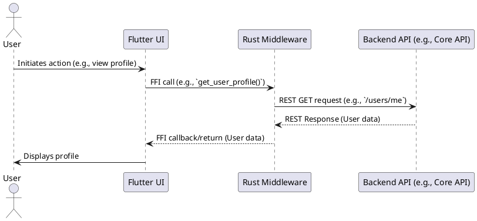
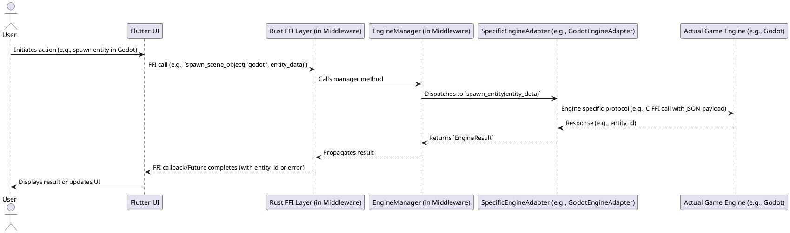
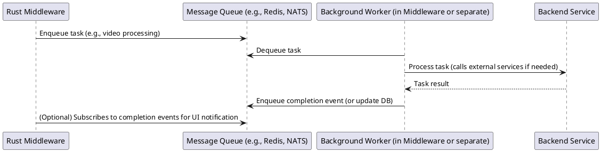

# Rust Middleware Architecture

This document outlines the architecture of the Rust-based middleware, its components, and how it interacts with other parts of the LUVY ecosystem.

## 1. Overview

The Rust middleware serves as a crucial layer bridging the Flutter UI with various backend services (Core, Engines, Data, etc.) and external AI models/engines. Its primary responsibilities include:

-   Providing a performant and type-safe API for the Flutter UI via FFI.
-   Aggregating and transforming data from multiple backend services.
-   Managing communication with engine adapters.
-   Handling business logic that doesn't fit neatly into a single backend service.
-   Ensuring secure communication with backend services.

## 2. Component Diagram

The following diagram illustrates the main components and their relationships.

```plantuml
@startuml
!theme materia

package "User Interface" {
  [Flutter UI]
}

package "Middleware (aurax_middleware)" {
  [Rust Middleware] {
    [EngineManager]
    [BevyEngineAdapter]
    [UnityEngineAdapter]
    [GodotEngineAdapter]
    [FFI Layer (ffi_editor_api.rs)]
  }
}

package "Game Engines" {
  [Bevy Engine (Rust Lib)]
  [Unity Engine (Process)]
  [Godot Engine (Process)]
}

package "Backend Services (APIs)" {
  [Core API]
  [Engines API]
  [Mindflow API]
  [GameJam API]
  [Data API]
  [Plugins API]
}

' Connections
[Flutter UI] ..> [FFI Layer (ffi_editor_api.rs)] : FFI Calls (flutter_rust_bridge)
[FFI Layer (ffi_editor_api.rs)] ..> [EngineManager] : Rust calls
[EngineManager] ..> [BevyEngineAdapter] : Dispatch
[EngineManager] ..> [UnityEngineAdapter] : Dispatch
[EngineManager] ..> [GodotEngineAdapter] : Dispatch

[BevyEngineAdapter] ..> [Bevy Engine (Rust Lib)] : Rust FFI
[UnityEngineAdapter] ..> [Unity Engine (Process)] : HTTP/WebSocket
[GodotEngineAdapter] ..> [Godot Engine (Process)] : C FFI

[Rust Middleware] --> [Core API] : REST/HTTP
[Rust Middleware] --> [Engines API] : REST/HTTP (Note: distinct from direct engine comms)
[Rust Middleware] --> [Mindflow API] : REST/HTTP
[Rust Middleware] --> [GameJam API] : REST/HTTP
[Rust Middleware] --> [Data API] : REST/HTTP
[Rust Middleware] --> [Plugins API] : REST/HTTP

@enduml
```

**Key Components:**

*   **Flutter UI:** The primary user interface for the LUVY platform, running on mobile, desktop, or web.
*   **Rust Middleware (`aurax_middleware`):** The central Rust application that handles requests from the UI, interacts with backend services, and manages communication with game engines.
    *   **FFI Layer (`ffi_editor_api.rs`):** Exposes Rust functionality to Flutter using `flutter_rust_bridge`.
    *   **`EngineManager`:** A Rust struct that manages instances of different engine adapters.
    *   **`EngineAdapter` Implementations (e.g., `BevyEngineAdapter`, `UnityEngineAdapter`, `GodotEngineAdapter`):** Rust structs that implement the `EngineAdapter` trait (defined in `engine_adapter_trait.rs`). They contain the logic to communicate with specific game engines.
*   **Backend Service APIs (Core, Engines, etc.):** These are REST APIs, potentially for managing cloud resources, user data, or other non-realtime aspects. The Rust middleware acts as a client to these services. The "Engines API" here is distinct from the direct real-time communication channels managed by the adapters.
*   **Game Engines:** The actual game engines.
    *   **Bevy Engine:** Integrated as a Rust library, allowing direct Rust FFI calls from its adapter.
    *   **Unity Engine:** Runs as a separate process, communicating via HTTP for commands and WebSockets for events.
    *   **Godot Engine:** Runs as a separate process, communicating via a C FFI layer (GDNative/GDExtension).

## 3. Interaction Patterns

### 3.1. UI Request to Backend API (Synchronous)

This is a common pattern for fetching data or triggering simple actions.



### 3.2. UI Request involving a Game Engine (Potentially Asynchronous)

This pattern is used when the UI needs to interact with a game engine.


*If the engine task is long-running, or for continuous event streams (like transform updates), the FFI layer utilizes Dart `Future`s and `Stream`s, respectively, managed by `flutter_rust_bridge`.*

### 3.3. Asynchronous Operations & Event Handling (Conceptual)

For long-running tasks or events pushed from the backend, a message queue or other async mechanism might be used within or alongside the middleware. (Further details in `rust_middleware_communication_protocols.md`).



## 4. Modularity within Rust Middleware

The Rust middleware itself will be structured into modules, likely mirroring the external services it interacts with, plus core FFI and engine adapter management:

    `ffi_editor_api.rs` (FFI Layer): Handles all FFI definitions for Flutter communication, using `flutter_rust_bridge`.
    `api_clients`: Contains clients for interacting with the various LUVY backend REST APIs (Core, Data, etc.). These clients will be generated or written based on OpenAPI specifications if applicable.
    `engine_manager.rs`: Manages the lifecycle and dispatch to different engine adapters.
    `engine_adapter_trait.rs`: Defines the `EngineAdapter` trait.
    `bevy_adapter.rs`, `unity_adapter.rs`, `godot_adapter.rs`, etc.: Implementations of the `EngineAdapter` trait for specific game engines.
    `engine_common_models.rs`: Contains shared data structures (structs, enums) used by adapters and potentially across the FFI boundary.
    `engines_api/models.rs`: Defines standardized event structures like `EngineRealtimeEvent`.
    `services` (or `use_cases`): Implements core business logic of the middleware, orchestrating calls to API clients and the `EngineManager`.
-   `config`: Handles configuration loading and management for the middleware.

Further details on communication protocols, data structures, and FFI are available in dedicated documents.
