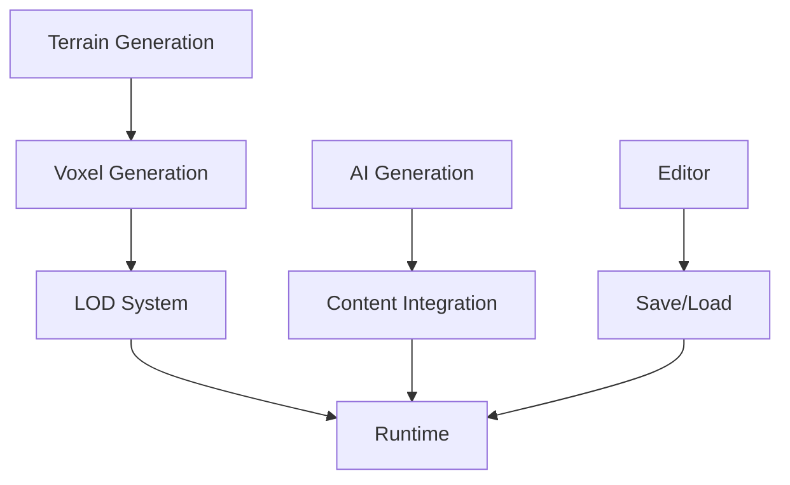

# Voxel Game Pipeline & Workflows

## 1. Prozedurale Generierung Pipeline

### 1.1 Terrain Generation
```dart
// TerrainGenerationService
class TerrainGenerationService {
  // Noise-basierte Höhenkarten-Generierung
  Future<HeightMap> generateHeightMap({
    required int width,
    required int height,
    required int seed,
    required NoiseParameters params
  });

  // Biome-Verteilung
  Future<BiomeMap> generateBiomeMap(HeightMap heightMap);

  // Ressourcen-Platzierung
  Future<ResourceMap> placeResources(BiomeMap biomeMap);
}
```

### 1.2 Voxel-Generierung
```dart
// VoxelGenerationService
class VoxelGenerationService {
  // Voxel-Mesh-Generierung
  Future<VoxelMesh> generateVoxelMesh({
    required HeightMap heightMap,
    required BiomeMap biomeMap,
    required ResourceMap resourceMap
  });

  // LOD (Level of Detail) System
  Future<VoxelMesh> generateLOD(VoxelMesh mesh, int detailLevel);
}
```

## 2. KI-Integration Pipeline

### 2.1 KI-Modell-Generierung
```dart
// AIModelGeneratorService
class AIModelGeneratorService {
  // Text-zu-3D Generierung
  Future<Model3D> generateFromText(String prompt);

  // Stil-Transfer
  Future<Model3D> applyStyle(Model3D model, String style);

  // Optimierung
  Future<Model3D> optimizeForGame(Model3D model);
}
```

### 2.2 KI-Content-Generierung
```dart
// AIContentGenerator
class AIContentGenerator {
  // Quest-Generierung
  Future<Quest> generateQuest(PlayerContext context);

  // NPC-Verhalten
  Future<BehaviorTree> generateNPCBehavior(NPCType type);

  // Dialog-Generierung
  Future<Dialog> generateDialog(NPC npc, PlayerContext context);
}
```

## 3. Workflow-Integration

### 3.1 Editor-Workflow
```dart
// EditorService
class EditorService {
  // Terrain-Editor
  Future<void> editTerrain(EditOperation operation);

  // Voxel-Editor
  Future<void> editVoxels(EditOperation operation);

  // KI-Assistenz
  Future<EditSuggestion> getAISuggestions(EditContext context);
}
```

### 3.2 Runtime-Workflow
```dart
// RuntimeService
class RuntimeService {
  // Chunk-Management
  Future<void> loadChunk(ChunkCoordinate coord);
  Future<void> unloadChunk(ChunkCoordinate coord);

  // Performance-Optimierung
  Future<void> optimizeChunk(Chunk chunk);
}
```

## 4. Pipeline-Integration

### 4.1 Datenfluss


### 4.2 Workflow-Beispiel
1. **Terrain-Generierung:**
   ```dart
   // 1. Höhenkarte generieren
   final heightMap = await terrainService.generateHeightMap(
     width: 1024,
     height: 1024,
     seed: 12345,
     params: noiseParams
   );

   // 2. Biome verteilen
   final biomeMap = await terrainService.generateBiomeMap(heightMap);

   // 3. Ressourcen platzieren
   final resourceMap = await terrainService.placeResources(biomeMap);
   ```

2. **Voxel-Generierung:**
   ```dart
   // 1. Voxel-Mesh erstellen
   final voxelMesh = await voxelService.generateVoxelMesh(
     heightMap: heightMap,
     biomeMap: biomeMap,
     resourceMap: resourceMap
   );

   // 2. LOD-Level generieren
   final lodMeshes = await Future.wait([
     voxelService.generateLOD(voxelMesh, 0), // High Detail
     voxelService.generateLOD(voxelMesh, 1), // Medium Detail
     voxelService.generateLOD(voxelMesh, 2)  // Low Detail
   ]);
   ```

3. **KI-Integration:**
   ```dart
   // 1. KI-Modell generieren
   final model = await aiService.generateFromText(
     "Ein magischer Kristall in einem Voxel-Stil"
   );

   // 2. Stil anwenden
   final styledModel = await aiService.applyStyle(
     model,
     "Fantasy-Kristall"
   );

   // 3. Für Spiel optimieren
   final gameModel = await aiService.optimizeForGame(styledModel);
   ```

## 5. Performance-Optimierung

### 5.1 Chunk-Management
```dart
// ChunkManager
class ChunkManager {
  // Chunk-Cache
  final Map<ChunkCoordinate, Chunk> _chunkCache = {};

  // Chunk laden
  Future<Chunk> loadChunk(ChunkCoordinate coord) async {
    if (_chunkCache.containsKey(coord)) {
      return _chunkCache[coord]!;
    }

    final chunk = await _generateChunk(coord);
    _chunkCache[coord] = chunk;
    return chunk;
  }

  // Chunk entladen
  void unloadChunk(ChunkCoordinate coord) {
    _chunkCache.remove(coord);
  }
}
```

### 5.2 LOD-System
```dart
// LODManager
class LODManager {
  // LOD-Level basierend auf Distanz
  int getLODLevel(Vector3 playerPos, ChunkCoordinate chunkCoord) {
    final distance = _calculateDistance(playerPos, chunkCoord);
    if (distance < 10) return 0;      // High Detail
    if (distance < 20) return 1;      // Medium Detail
    return 2;                         // Low Detail
  }
}
```

## 6. KI-Workflow-Integration

### 6.1 Content-Generierung
```dart
// AIContentManager
class AIContentManager {
  // Quest generieren
  Future<Quest> generateQuest(PlayerContext context) async {
    final quest = await aiService.generateQuest(context);
    return _validateAndOptimizeQuest(quest);
  }

  // NPC-Verhalten generieren
  Future<BehaviorTree> generateNPCBehavior(NPCType type) async {
    final behavior = await aiService.generateNPCBehavior(type);
    return _optimizeBehaviorTree(behavior);
  }
}
```

### 6.2 Editor-Assistenz
```dart
// AIEditorAssistant
class AIEditorAssistant {
  // Vorschläge generieren
  Future<List<EditSuggestion>> getSuggestions(EditContext context) async {
    final suggestions = await aiService.getAISuggestions(context);
    return _filterAndRankSuggestions(suggestions);
  }

  // Automatische Optimierung
  Future<void> optimizeContent(Content content) async {
    final optimized = await aiService.optimizeForGame(content);
    await _applyOptimizations(optimized);
  }
}
```

## 7. Best Practices

### 7.1 Performance
- Chunk-basiertes Laden/Entladen
- LOD-System für Distanz-basierte Detailstufen
- Asynchrone Generierung
- Caching-Strategien

### 7.2 KI-Integration
- Validierung der KI-Generierung
- Optimierung für Spiel-Performance
- Fallback-Mechanismen
- Kontinuierliches Training

### 7.3 Workflow
- Modulare Pipeline
- Klare Verantwortlichkeiten
- Asynchrone Verarbeitung
- Fehlerbehandlung

## 8. Nächste Schritte

1. **Pipeline-Optimierung:**
   - Performance-Metriken implementieren
   - Caching-Strategien verfeinern
   - LOD-System optimieren

2. **KI-Integration:**
   - Mehr KI-Modelle integrieren
   - Training-Daten erweitern
   - Validierung verbessern

3. **Workflow-Verbesserung:**
   - Editor-Tools erweitern
   - Automatisierung erhöhen
   - Dokumentation aktualisieren 